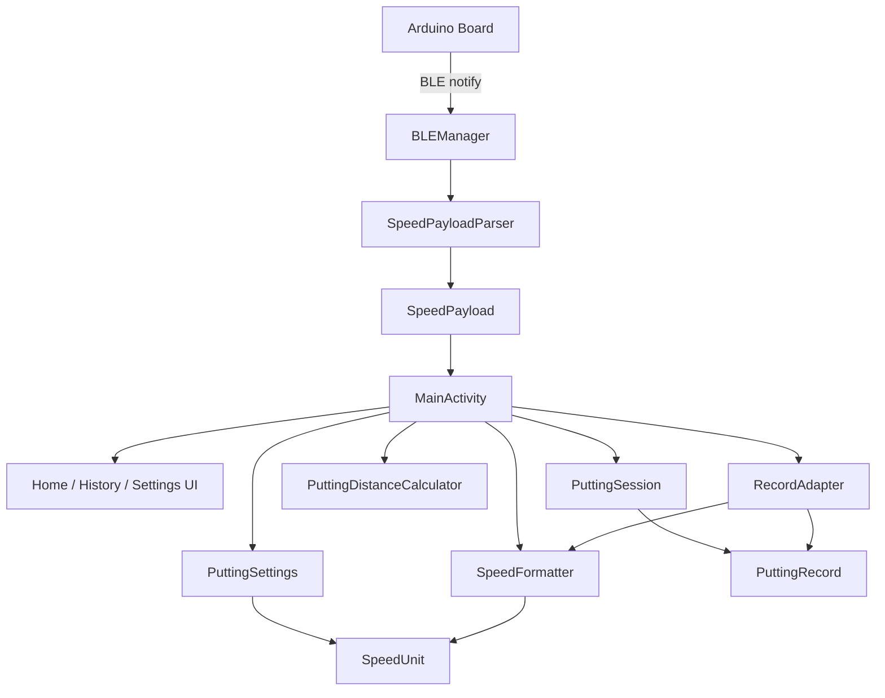
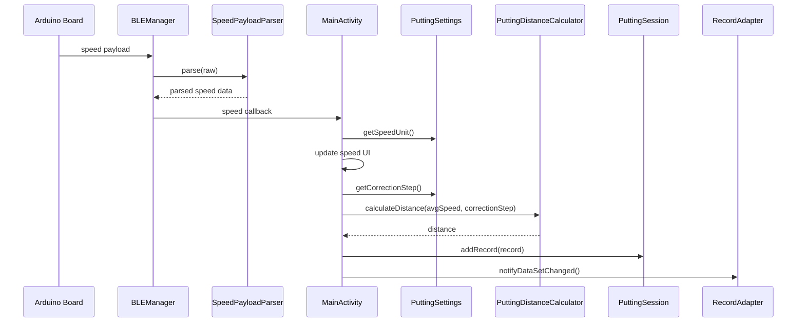
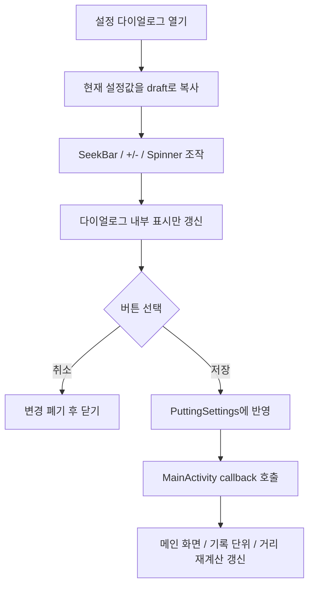

# PuttingMeter

PuttingMeter는 퍼팅 스트로크에서 측정한 속도를 기반으로 예상 비거리를 계산하고, 반복 연습 기록을 확인할 수 있는 Android + Arduino 프로젝트입니다.

Arduino 보드는 IMU 센서로 퍼팅 동작을 감지하고 BLE로 속도 데이터를 전송합니다. Android 앱은 BLE 데이터를 수신해 피크 속도, 평균 속도, 예상 비거리, 최근 기록, 그린 스피드 보정값을 화면에 표시합니다.

## 주요 기능

- Arduino Nano 계열 보드의 IMU 기반 퍼팅 스트로크 감지
- BLE 연결, 재연결, 보드 리셋 명령 전송
- 피크 속도와 평균 속도 표시
- 보정 단계 기반 예상 비거리 계산
- 최근 퍼팅 기록 목록 표시
- 속도 단위 변경: `mm/s`, `cm/s`, `m/s`
- 그린 스피드 보정 단계 설정: `1 ~ 10`
- 설정 저장/취소 동작 분리

## 화면 구성

아래 이미지는 앱의 주요 화면입니다. 스크린샷 파일을 `docs/screenshots/` 아래에 커밋해두면 GitHub README에서 바로 렌더링됩니다(파일이 없으면 이미지가 깨져 보입니다).

| 메인화면 | 기록화면 | 설정화면 | 그린스피드 설정화면 |
| --- | --- | --- | --- |
|  |  |  |  |
| BLE 연결 상태, 예상 비거리, 피크/평균 속도 표시 | 최근 퍼팅 기록의 피크/평균 속도, 비거리, 시간 표시 | 보정 설정 진입, 데이터 초기화, 기기 재연결 | 보정 단계와 속도 단위 설정 및 저장/취소 |

## 프로젝트 구조

```text
PuttingMeter/
├─ aduino/
│  ├─ aduino.ino
│  └─ run_arduino.ps1
├─ android/
│  ├─ app/src/main/java/com/example/puttingmeter/
│  │  ├─ BLEManager.java
│  │  ├─ MainActivity.java
│  │  ├─ PuttingDistanceCalculator.java
│  │  ├─ RecordAdapter.java
│  │  ├─ ble/
│  │  ├─ format/
│  │  ├─ model/
│  │  ├─ session/
│  │  └─ settings/
│  └─ app/src/test/java/com/example/puttingmeter/
└─ README.md
```

## Android 구조



## 측정 데이터 흐름



## 설정 저장 흐름



## 주요 모듈

| 모듈 | 역할 |
| --- | --- |
| `MainActivity` | BLE 이벤트를 받아 화면 상태를 갱신하고, 화면 전환과 주요 UI 이벤트를 연결합니다. |
| `BLEManager` | BLE 스캔, 연결, characteristic 구독, 보드 명령 전송을 담당합니다. |
| `ble/SpeedPayloadParser` | Arduino에서 수신한 속도 payload를 검증하고 파싱합니다. |
| `format/SpeedUnit` | 속도 단위와 단위 변환 기준을 정의합니다. |
| `format/SpeedFormatter` | 속도 값을 현재 단위에 맞게 표시 문자열로 변환합니다. |
| `model/PuttingRecord` | 한 번의 퍼팅 기록 데이터를 표현합니다. |
| `session/PuttingSession` | 최근 기록 목록과 최고 거리 상태를 관리합니다. |
| `settings/PuttingSettings` | 보정 단계와 속도 단위 설정값을 보관합니다. |
| `settings/SettingsDialogController` | 설정 다이얼로그 생성, draft 설정 편집, 저장/취소 처리를 담당합니다. |
| `PuttingDistanceCalculator` | 평균 속도와 보정 단계로 예상 비거리를 계산합니다. |
| `RecordAdapter` | 최근 기록 RecyclerView 표시를 담당합니다. |

## 개발 환경

- Android Studio
- Gradle
- Java
- Arduino CLI 또는 Arduino IDE
- Arduino Nano 계열 보드

## 빠른 시작

### Android 앱

```powershell
cd D:\PuttingMeter\android
.\gradlew.bat :app:compileDebugJavaWithJavac
.\gradlew.bat :app:testDebugUnitTest
```

Android Studio에서 `android/` 폴더를 열고 앱을 실행합니다. BLE 권한을 허용한 뒤 `Putting Speed Meter` 장치에 연결합니다.

### Arduino 펌웨어

```powershell
cd D:\PuttingMeter\aduino
powershell -ExecutionPolicy Bypass -File .\run_arduino.ps1
```

보드 포트와 FQBN은 환경에 맞게 `run_arduino.ps1`에서 조정합니다.

## 검증 명령

```powershell
cd D:\PuttingMeter
git diff --check

cd D:\PuttingMeter\android
.\gradlew.bat :app:compileDebugJavaWithJavac --rerun-tasks
.\gradlew.bat :app:testDebugUnitTest
.\gradlew.bat :app:assembleDebug
```

## 현재 리팩터링 상태

현재 Android 앱은 Phase 0부터 Phase 6D까지의 리팩터링을 통해 `MainActivity`에 집중되어 있던 책임을 작은 모듈로 분리했습니다.

- 기록 모델 분리
- 속도 단위 변환 분리
- BLE payload 파싱 분리
- 퍼팅 세션 상태 분리
- 미사용 Fragment/Navigation 제거
- 설정값 모델 분리
- 설정 적용 로직 분리
- 설정 다이얼로그 controller 분리
- 설정 저장/취소 흐름 정리

Phase 7 이후의 Arduino 센서 처리 함수 분리는 아직 진행하지 않았습니다.
